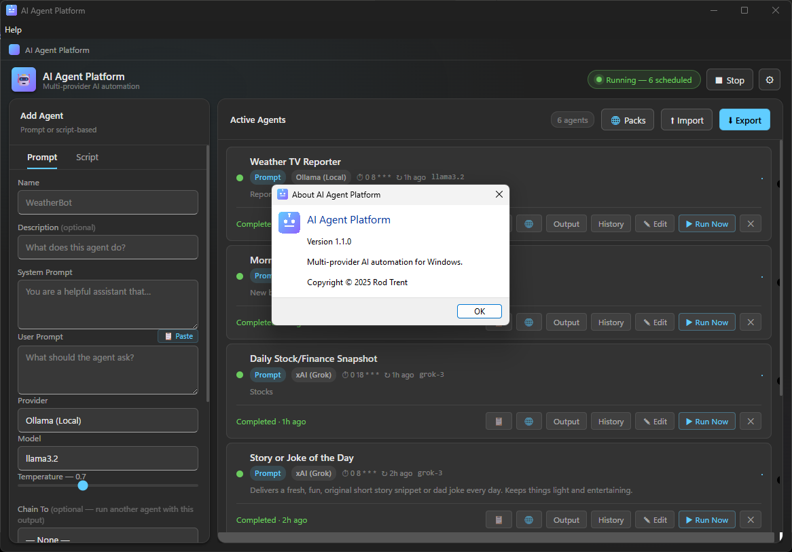

# AI Agent Platform: Now at v1.1.0

*By Rod Trent | Updated April 6, 2026*

---

If you've spent any time building AI agents, you've probably noticed a familiar pattern: a Python script here, a Streamlit app there, a cron job cobbled together somewhere else, and a pile of API keys scattered across `.env` files you've half-forgotten about. It works — until it doesn't. Updating a prompt means opening a terminal. Changing a schedule means editing a crontab. Checking whether an agent actually ran means digging through logs.

I wanted something better. Something that felt like a real Windows application — not a browser tab, not a terminal window, not a dependency manager waiting to break. So I built it.

**AI Agent Platform** is a standalone Windows 11 desktop application that lets you create, schedule, and monitor AI agents against any major LLM provider — with nothing to install beyond the app itself.


*AI Agent Platform v1.1.0 — main window.*

---

## What It Does

At its core, AI Agent Platform is a scheduling engine for two kinds of agents:

**Prompt Agents** connect to an LLM — any LLM — with a system prompt and a user prompt, run on a schedule you define, and capture the response directly in the app. Think daily summaries, automated research briefings, content drafts, data analysis, or anything else you'd normally send to a chatbot by hand, now running automatically on a timer.

**Script Agents** run any existing script or executable — Python, PowerShell, Node.js, a compiled `.exe`, whatever you already have — on the same cron-based scheduler. If you've already built agents in another environment, you can import them here without rewriting a line of code.

Both types display live status, last-run timestamps, and captured output directly on their cards in the main window. No log files. No terminals. Just results.

---

## Provider Agnostic by Design

One of the core design goals was to avoid locking the platform to any single AI provider. The app ships with built-in support for five providers — and switching between them is a matter of clicking a chip and pasting an API key:

| Provider | Notes |
|---|---|
| **xAI (Grok)** | [xAI API key](https://console.x.ai) required |
| **OpenAI** | [OpenAI API key](https://platform.openai.com) required |
| **Anthropic (Claude)** | [Anthropic API key](https://console.anthropic.com) required |
| **Ollama (Local)** | No key required — runs entirely on your machine |
| **Custom / Other** | Any OpenAI-compatible endpoint — bring your own base URL and key |

Each agent independently selects its provider and model, so you can run a Claude agent for summarization, a Grok agent for research, and an Ollama agent for a local task — all on the same scheduler, at the same time.

---

## A Windows App That Actually Looks Like a Windows App

The UI is built on the Windows 11 **Fluent Design System** — Mica background material, Acrylic blur layers, Fluent motion tokens, and Segoe UI Variable throughout. It feels native because it's designed to be.

The sidebar handles everything about creating or editing an agent. The **Prompt** tab exposes the full LLM configuration — system prompt, user prompt, provider, model, temperature, and schedule:


*Configuring a prompt-based agent with provider and model selection.*

The **Script** tab is for existing automation. Point it at any script, set a command interpreter and a timeout, pick a schedule:


*Configuring a script-based agent — Python, PowerShell, Node.js, or any executable.*

---

## Settings That Stay Out of Your Way

The Settings dialog handles provider configuration, system tray behavior, Windows startup, and notification preferences — all in one place:


*Per-provider API key management, tray, startup, and notification toggles — all in one dialog.*

A few things worth noting about how credentials are handled:

- **Keys are stored locally** in `Documents\AIAgentPlatform\settings.json` — a plain file on your machine, under your control
- **Keys are never transmitted** anywhere except directly to the provider's API endpoint you configured
- **The masked hint** (e.g. `xai-SanS...lWxH`) lets you verify which key is stored without exposing it

The **Minimize to System Tray** toggle keeps agents running even when you close the window — the scheduler stays alive in the background, and the tray icon gives you one-click access to open the app or stop the scheduler. The **Run at Windows Startup** toggle writes directly to the Windows registry so your agents are ready to go from the moment you sign in.

---

## How the Scheduler Works

Scheduling uses standard **cron expressions**. The app ships with a dropdown of the most common presets — every 5 minutes, every hour, daily at 8 AM, weekdays at 9 AM — plus a "Custom cron…" option backed by the new visual builder (more on that below). Behind the scenes, `node-cron` handles the scheduling with overlap prevention built in: if an agent is still running when its next tick fires, the new run is skipped rather than stacked.

When the scheduler is running, the pill in the header shows the count of active agents and updates in real time as agents complete, fail, or are added and removed.

---

## No Cloud, No Runtime, No Drama

The app is a single installable `.exe` — built with Electron and packaged with electron-builder into a standard NSIS installer that supports both **x64** and **ARM64** (including Snapdragon-based Windows PCs). The installer auto-detects your architecture and installs the right version. After installation:

- **No Node.js required** on the target machine — the runtime is bundled
- **No Python required** — no virtual environments, no `pip install`, no version conflicts
- **No internet connection required** to run the app itself — only the actual LLM API calls go out, to the provider you chose
- **All data lives in `Documents\AIAgentPlatform\`** — survives app updates and reinstalls, and is easy to back up

```
Documents\AIAgentPlatform\
├── agent_registry.json     ← agent definitions and latest run state
├── settings.json           ← provider config and app preferences
└── history\
    └── {agentId}.json      ← per-agent run history (up to 50 entries each)
```

There's a side effect of that location worth calling out: because the data folder sits inside `Documents\`, it is automatically synced by **OneDrive** — and any other folder-sync service you use. Install AI Agent Platform on a second machine, sign in to the same OneDrive account, and your agents, settings, and provider keys are already there before you open the app for the first time. No export, no copy, no reconfiguration.

---

## Share Your Agents

One of the most requested things in any automation tool is the ability to share your work. AI Agent Platform makes that simple: every agent you create can be exported to a plain JSON file and imported by anyone else running the app.


Hit **⬇ Export** in the Active Agents header and a native Save dialog appears. The file contains everything needed to recreate your agents — names, prompts, providers, models, schedules — with runtime state and API keys intentionally excluded.

On the receiving end, **⬆ Import** opens a file picker, reads the JSON, and adds each new agent to the local registry. If an agent with the same name already exists it is skipped rather than overwritten, and the import toast tells you exactly what happened:

> *Imported 3 agents. Skipped 1 duplicate (WeatherBot).*

---

## What's New in v1.1.0

V1.1.0 ships nine new features based on feedback from early users. Here's what changed.

### Output History

The app now persists every run result — not just the most recent one. Each agent stores up to 50 entries in its own history file under `Documents\AIAgentPlatform\history\`. Click the **History** button on any agent card to open a scrollable dialog showing every past run with its timestamp, status, and full output. Each entry has its own **📋 Copy** and **🌐 Open as HTML** buttons.

### Windows Toast Notifications

Agents now fire native Windows toast notifications when they complete or fail — the same system notifications you get from any other Windows app, appearing in the notification center and as a pop-up in the corner of the screen. There's a toggle in Settings to turn them off if you prefer a quieter experience.

### Agent Chaining

This one changes how you think about what agents can do. Every agent now has an optional **Chain To** field. Set it to another agent and, after a successful run, the first agent's output is automatically injected as the `userPrompt` of the second agent — which then triggers immediately.

The practical upshot: multi-step pipelines with no code. A *News Summarizer* can feed directly into a *Tweet Drafter*. A *Market Snapshot* can chain into an *Email Formatter*. The chain badge on the card shows you at a glance which agent fires next.

### Import from Clipboard

Creating an agent from a prompt you've been refining in a chat session used to mean copying it, switching apps, finding the field, and pasting. Now there's a **📋 Paste** button right next to the User Prompt field. One click and your clipboard contents land in the form.

### Test Before Saving

The **▶ Test** button in the sidebar runs your current form configuration once without saving anything. The result — or the error — appears in a panel below the buttons immediately. Iterate on your prompt, test again, save when it's right. No more creating an agent, running it, checking the output, deleting it, and starting over.

### Copy Output and Open as HTML

Two new buttons on every agent card:

- **📋** copies the latest output to the clipboard in one click
- **🌐** renders the output as a styled HTML page and opens it in your default browser

The HTML renderer converts markdown headings, lists, code blocks, bold, italic, and links into clean, readable HTML with a light theme — no external dependencies, no Markdown library to ship. It's useful any time an agent produces a long formatted response that's easier to read in a browser than in the app's output panel.

### Enhanced Cron Builder

"Custom cron…" used to drop you straight into a text box. Now it opens a two-tab panel:

**Builder** — choose a frequency pattern (every N minutes, every N hours, daily, weekly, or monthly), pick a time and day from dropdowns, and watch the cron expression and a plain-English description update live. No cron syntax knowledge required.

**Expression** — the original raw text input, for users who already know what `0 9 * * 1-5` means and just want to type it.

Both tabs stay in sync. Switch from Builder to Expression and the generated expression is already there.

### Community Agent Packs

The **🌐 Packs** button in the Active Agents header opens a gallery that fetches ready-to-import agent packs from the project's GitHub repository. Each pack is a curated collection of agents around a common theme. Click **Install** and the entire pack is imported in one step.

Six packs ship with v1.1.0:

| Pack | What it does |
|---|---|
| **Cybersecurity Daily Briefing** | Threat intelligence and news digest, daily at 7 AM |
| **Morning Briefing Pack** | News brief + story/joke of the day, daily at 8 AM |
| **Finance & Markets Pack** | Stock market snapshot, daily at 6 PM |
| **Daily Learning Pack** | Spaced-repetition flashcards on any topic, daily at 8 AM |
| **AI & Tech Digest Pack** | AI news daily + weekly broader tech trends |
| **Daily Productivity Pack** | Focus plan and tips, weekdays at 7 AM |

The packs index is a plain JSON file in the repo — adding a new pack is a pull request.

---

## Get It

The project is open source under the MIT license.

**GitHub:** [https://github.com/rod-trent/AgentPlatform](https://github.com/rod-trent/AgentPlatform)

To run from source:

```bat
git clone https://github.com/rod-trent/AgentPlatform.git
cd AgentPlatform
npm install
npm start
```

To build the installer:

```bat
npm run build
```

The installer lands in `dist\AI Agent Platform Setup 1.1.0.exe`.

---

## What's Next

A few things already on the list for v1.2.0:

- **Conditional logic** — only trigger a chained agent if the upstream output matches a pattern or keyword
- **Agent groups** — tag agents into logical groups and start/stop an entire group at once
- **Run on demand from the tray** — right-click any agent directly from the system tray icon and run it without opening the main window
- **Output diffing** — highlight what changed between the current and previous run result
- **Webhook triggers** — fire an agent in response to an incoming HTTP request instead of (or in addition to) a schedule

If you build something with it, run into a bug, or have a feature idea, open an issue on GitHub. Pull requests welcome.

---

*AI Agent Platform is open source software released under the MIT License. Copyright © 2025 Rod Trent.*
