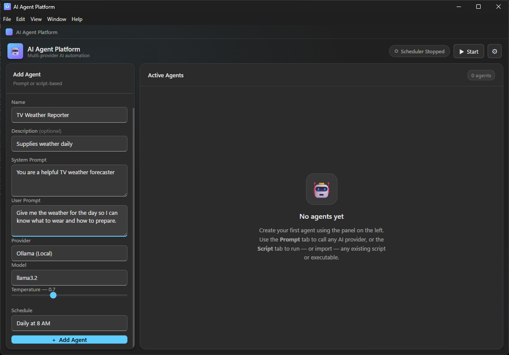
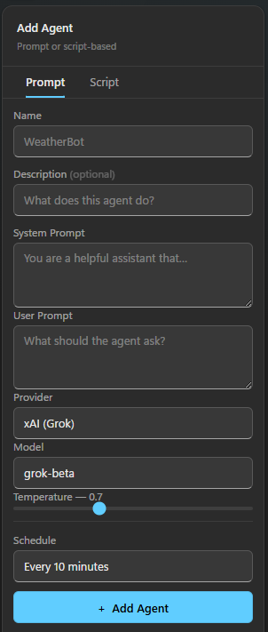
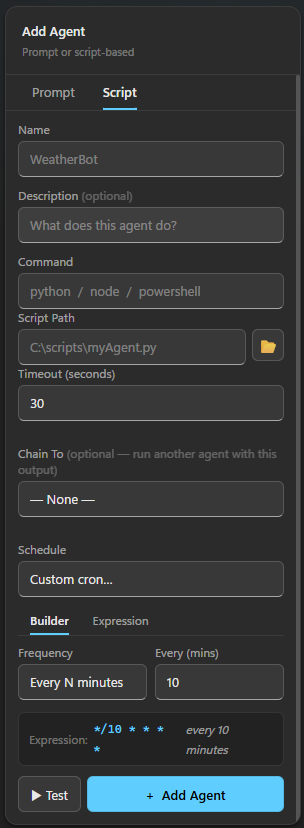
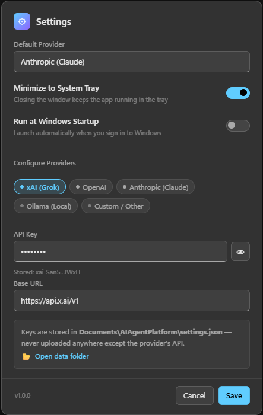
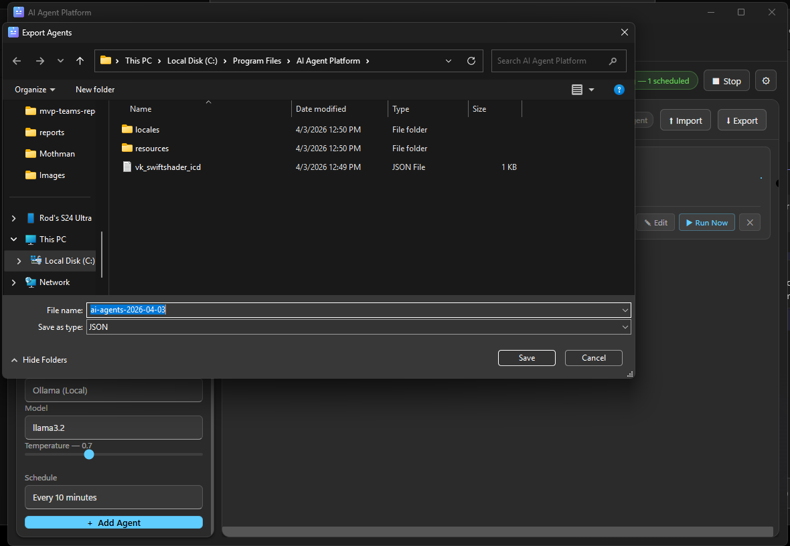

# Introducing AI Agent Platform: Schedule Any AI Agent on Windows — No Python Required

*By Rod Trent | April 3, 2026*

---

If you've spent any time building AI agents, you've probably noticed a familiar pattern: a Python script here, a Streamlit app there, a cron job cobbled together somewhere else, and a pile of API keys scattered across `.env` files you've half-forgotten about. It works — until it doesn't. Updating a prompt means opening a terminal. Changing a schedule means editing a crontab. Checking whether an agent actually ran means digging through logs.

I wanted something better. Something that felt like a real Windows application — not a browser tab, not a terminal window, not a dependency manager waiting to break. So I built it.

**AI Agent Platform** is a standalone Windows 11 desktop application that lets you create, schedule, and monitor AI agents against any major LLM provider — with nothing to install beyond the app itself.

---

## What It Does

At its core, AI Agent Platform is a scheduling engine for two kinds of agents:

**Prompt Agents** connect to an LLM — any LLM — with a system prompt and a user prompt, run on a schedule you define, and capture the response directly in the app. Think daily summaries, automated research briefings, content drafts, data analysis, or anything else you'd normally send to a chatbot by hand, now running automatically on a timer.

**Script Agents** run any existing script or executable — Python, PowerShell, Node.js, a compiled `.exe`, whatever you already have — on the same cron-based scheduler. If you've already built agents in another environment, you can import them here without rewriting a line of code.

Both types display live status, last-run timestamps, and captured output directly on their cards in the main window. No log files. No terminals. Just results.

---

## Provider Agnostic by Design

One of the core design goals was to avoid locking the platform to any single AI provider. The app ships with built-in support for five providers — and switching between them is a matter of clicking a chip and pasting an API key:

| Provider | Notes |
|---|---|
| **xAI (Grok)** | [xAI API key](https://console.x.ai) required |
| **OpenAI** | [OpenAI API key](https://platform.openai.com) required |
| **Anthropic (Claude)** | [Anthropic API key](https://console.anthropic.com) required |
| **Ollama (Local)** | No key required — runs entirely on your machine |
| **Custom / Other** | Any OpenAI-compatible endpoint — bring your own base URL and key |

Each agent independently selects its provider and model, so you can run a Claude agent for summarization, a Grok agent for research, and an Ollama agent for a local task — all on the same scheduler, at the same time.

---

## A Windows App That Actually Looks Like a Windows App

The UI is built on the Windows 11 **Fluent Design System** — Mica background material, Acrylic blur layers, Fluent motion tokens, and Segoe UI Variable throughout. It feels native because it's designed to be.


*The main window with the Add Agent sidebar and Active Agents panel.*

The sidebar handles everything about creating or editing an agent. The **Prompt** tab exposes the full LLM configuration — system prompt, user prompt, provider, model, temperature, and schedule:



*Configuring a prompt-based agent with provider and model selection.*

The **Script** tab is for existing automation. Point it at any script, set a command interpreter and a timeout, pick a schedule:



*Configuring a script-based agent — Python, PowerShell, Node.js, or any executable.*

---

## Settings That Stay Out of Your Way

The Settings dialog handles provider configuration, system tray behavior, and Windows startup — all in one place:



*Per-provider API key management, system tray and startup toggles, and app version — all in one dialog.*

A few things worth noting about how credentials are handled:

- **Keys are stored locally** in `Documents\AIAgentPlatform\settings.json` — a plain file on your machine, under your control
- **Keys are never transmitted** anywhere except directly to the provider's API endpoint you configured
- **The masked hint** (e.g. `xai-SanS...lWxH`) lets you verify which key is stored without exposing it

The **Minimize to System Tray** toggle keeps agents running even when you close the window — the scheduler stays alive in the background, and the tray icon gives you one-click access to open the app or stop the scheduler. The **Run at Windows Startup** toggle writes directly to the Windows registry so your agents are ready to go from the moment you sign in.

---

## How the Scheduler Works

Scheduling uses standard **cron expressions**. The app ships with a dropdown of the most common presets — every 5 minutes, every hour, daily at 8 AM, weekdays at 9 AM — plus a "Custom cron…" option for anything else. Behind the scenes, `node-cron` handles the scheduling with overlap prevention built in: if an agent is still running when its next tick fires, the new run is skipped rather than stacked.

When the scheduler is running, the pill in the header shows the count of active agents and updates in real time as agents complete, fail, or are added and removed.

---

## No Cloud, No Runtime, No Drama

The app is a single installable `.exe` — built with Electron and packaged with electron-builder into a standard NSIS installer. After installation:

- **No Node.js required** on the target machine — the runtime is bundled
- **No Python required** — no virtual environments, no `pip install`, no version conflicts
- **No internet connection required** to run the app itself — only the actual LLM API calls go out, to the provider you chose
- **All data lives in `Documents\AIAgentPlatform\`** — survives app updates and reinstalls, and is easy to back up

```
Documents\AIAgentPlatform\
├── agent_registry.json   ← agent definitions and run history
└── settings.json         ← provider config and app preferences
```

---
## Share Your Agents

One of the most requested things in any automation tool is the ability to share your work. AI Agent Platform makes that simple: every agent you create can be exported to a plain JSON file and imported by anyone else running the app.



Hit **⬇ Export** in the Active Agents header and a native Save dialog appears, defaulting the filename to something like `ai-agents-2026-04-03.json`. The file contains everything needed to recreate your agents — names, prompts, providers, models, schedules — with runtime state and API keys intentionally excluded. What gets exported is the definition, not the secrets.

On the receiving end, **⬆ Import** opens a file picker, reads the JSON, and adds each new agent to the local registry. If an agent with the same name already exists it is skipped rather than overwritten, and the import toast tells you exactly what happened:

> *Imported 3 agents. Skipped 1 duplicate (WeatherBot).*

The format is a readable JSON envelope so it can be stored in a GitHub repo, shared in a team chat, attached to a blog post, or checked into source control alongside the scripts the agents run. A community of shareable agent packs is a natural next step.

```json
{
  "exportedBy": "AI Agent Platform",
  "version": "1.0.0",
  "exportedAt": "2026-04-03T12:00:00.000Z",
  "agents": [
    {
      "name": "Daily News Summary",
      "type": "prompt",
      "provider": "anthropic",
      "model": "claude-opus-4-6",
      "systemPrompt": "You are a concise news summarizer...",
      "userPrompt": "Summarize the top technology stories today.",
      "schedule": "0 8 * * 1-5"
    }
  ]
}
```

## Get It

The project is open source under the MIT license.

**GitHub:** [https://github.com/rod-trent/AgentPlatform](https://github.com/rod-trent/AgentPlatform)

To run from source:

```bat
git clone https://github.com/rod-trent/AgentPlatform.git
cd AgentPlatform
npm install
npm start
```

To build the installer:

```bat
npm run build
```

The installer lands in `dist\AI Agent Platform Setup 1.0.0.exe`.

---

## What's Next

This is v1.0.0 — the foundation. A few things already on the list:

- **Output history** — persist and browse previous run results per agent, not just the most recent
- **Notifications** — Windows toast notifications on agent completion or failure
- **Agent chaining** — pipe the output of one agent into the input of another
- **Import from clipboard** — paste a prompt directly from a chat session to create an agent in seconds
- **Shared agent packs** — a community repository of ready-to-import agent collections for common tasks

If you build something with it, run into a bug, or have a feature idea, open an issue on GitHub. Pull requests welcome.

---

*AI Agent Platform is open source software released under the MIT License. Copyright © 2025 Rod Trent.*
