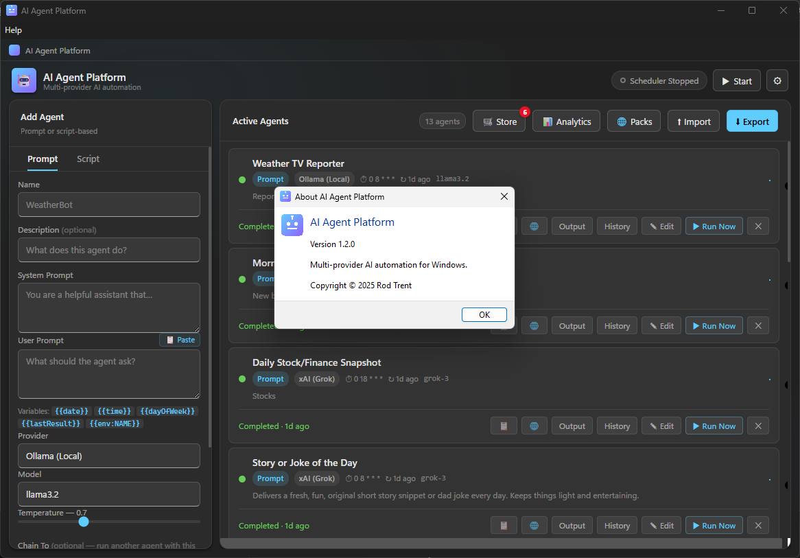

# AI Agent Platform v1.2.0: Smarter Agents, Safer Keys, and a Store

*By Rod Trent | April 9, 2026*

---

Every version of AI Agent Platform starts with a simple question: what's still getting in the way?

With v1.1.0 we shipped output history, agent chaining, toast notifications, community packs, and a visual cron builder. Useful things. But some friction remained. Prompts were still static — they couldn't reference today's date, or last run's output, without you manually editing them each time. Chaining always fired on success, whether you wanted that or not. There was no way to fire an agent from outside the app. And API keys, while never transmitted anywhere they shouldn't be, were sitting in a plain JSON file on disk.

V1.2.0 addresses all of that — and adds two entirely new surfaces: a live **Agent Store** and a **Run Analytics** dashboard.


*AI Agent Platform v1.2.0 — main window.*

---

## What's New

### 1. Agent Store

The community packs from v1.1.0 let you install curated agent *collections* in one click. The new **🛒 Store** takes that further: it connects directly to the GitHub repository's `Samples/` folder and lets you browse and install individual agents, one at a time.

Click **Store** in the Active Agents header. The dialog fetches the current list from GitHub, loads metadata for each agent — name, provider, model, description, schedule — and displays it as a card gallery:

- Each card shows exactly what the agent does and how it's configured
- Click **Add** to install a single agent without touching the rest of your setup
- Already-installed agents show a **✓ Installed** state so you can see at a glance what you have and what you're missing
- A **red badge** on the Store button appears automatically at startup when new agents are available that you haven't installed yet — so you're never guessing whether the store has something new

The store is live. Add a new `.json` file to the `Samples/` folder in the repository and it appears in the store the next time anyone opens it. No re-deploy, no rebuild, no version bump required.

**Why it matters:** Packs are great for getting started. The Store is for when you know exactly which agent you want and don't need to import a whole collection to get it.

---

### 2. Run Analytics Dashboard

Every run result has always been stored in history. V1.2.0 finally puts that data to work.

Click **📊 Analytics** in the Active Agents header to open a table showing aggregated statistics for every agent on your platform:

| Column | What it shows |
|---|---|
| **Agent** | Name and type (Prompt / Script) |
| **Runs** | Total number of completed runs |
| **Success %** | Success rate, colour-coded green (≥80%), yellow (≥50%), red (<50%) |
| **Failures** | Count of failed runs |
| **Avg Duration** | Mean run time in ms or seconds |
| **Last Run** | Relative time since last execution |

The table is sorted by run count — your busiest agents appear first. Agents with no history are excluded.

**Why it matters:** Before analytics, the only way to know an agent was silently failing was to notice that its card said "error" the next time you opened the app. Now you can see a 30% success rate from across the room and know something needs attention.

---

### 3. Variable Substitution in Prompts

This one is deceptively simple and immediately changes how useful prompt agents can be.

Both the system prompt and user prompt now support template variables using `{{double braces}}` syntax. They're resolved at run time — every time the agent executes — so each run gets a fresh, context-aware prompt with no manual editing.

| Variable | Resolves to |
|---|---|
| `{{date}}` | Today's date in your locale (e.g. *4/9/2026*) |
| `{{time}}` | Current time in your locale (e.g. *10:45:00 AM*) |
| `{{datetime}}` | Full date and time |
| `{{dayOfWeek}}` | The name of the current day (e.g. *Wednesday*) |
| `{{year}}` / `{{month}}` / `{{day}}` | Numeric date parts for custom formatting |
| `{{lastResult}}` | The agent's own most recent output |
| `{{env:VAR_NAME}}` | Any environment variable on your machine |

A hint row below the User Prompt field shows all available variables without having to look them up.

**Practical examples:**

A daily news agent that used to say *"What are the top technology headlines today?"* can now say *"What are the top technology headlines for {{dayOfWeek}}, {{date}}?"* — and every run's output is stamped with the actual date, making history entries trivially sortable.

An agent that writes a daily email draft can use `{{lastResult}}` to reference yesterday's draft and ask the LLM to improve it. Combined with chaining, `{{lastResult}}` lets each agent in a pipeline build on the work of the previous run.

`{{env:CITY}}` lets you store location-sensitive values as environment variables and reference them from prompts without hardcoding anything in the agent definition.

**Why it matters:** Static prompts produce static outputs. Variable substitution turns a scheduled agent into something that actually responds to when it's running and what's already happened.

---

### 4. Conditional Agent Chaining

In v1.1.0, chaining always fired on success. That covers the most common case — but not all of them.

V1.2.0 adds a **Chain Condition** dropdown that appears whenever a chain target is selected. Four options:

| Condition | When the downstream agent fires |
|---|---|
| **On success** | Only when the upstream agent completes without error (unchanged default) |
| **Always** | After every run, regardless of outcome |
| **On error only** | Only when the upstream agent fails |
| **If output contains…** | Only when the output includes a specific keyword or phrase |

The "if output contains" option includes a text field for the keyword. The match is case-insensitive.

**Why each condition is useful:**

*Always* is for audit or logging agents — an agent that records every run result somewhere, whether the upstream succeeded or not.

*On error* is for alerting. Chain your critical agent to a notification-drafting agent set to fire on error only, and you get an automatically generated failure summary every time something goes wrong — without triggering it on every successful run.

*If output contains* is the most powerful. A market-data agent that chains to a "send me a trading alert" agent only when the output contains the word "surge" or "crash". A monitoring agent that chains to an incident-response agent only when it detects "anomaly" in the result. Pattern-based conditional logic in a dropdown, no code required.

The condition is stored in the agent definition and exported with it, so shared agents preserve their chain behavior.

---

### 5. Webhook Trigger Server

Until now, agents could only be triggered by their schedule or the **▶ Run Now** button. V1.2.0 adds a third option: an HTTP endpoint.

Enable the **Webhook Trigger Server** toggle in Settings and set a port (default: 7171). Once enabled, any tool that can make an HTTP request can fire any agent on demand:

```
POST http://127.0.0.1:7171/trigger/{agentId}
```

The response tells you whether the trigger was accepted:

```json
{ "ok": true, "agentId": "abc-123", "queued": true }
```

The agentId is the internal UUID shown in the agent's exported JSON file. A health check endpoint is also available at `GET http://127.0.0.1:7171/health`.

The Settings dialog shows the live trigger URL as you configure it, so you can copy it directly.

**Important:** the server binds exclusively to `127.0.0.1` — the loopback address. It is never reachable from another machine on your network, let alone the internet.

**Why it matters:** Schedules are great for regular cadences. But sometimes you want an agent to run *now*, in response to something that just happened — a file appearing in a folder, a CI job completing, another script detecting a condition. Webhooks connect AI Agent Platform to the rest of your automation stack without any additional infrastructure.

**Practical examples:**

- A PowerShell `FileSystemWatcher` that hits the webhook every time a new log file appears in a directory — triggering an agent that analyzes the log with an LLM
- A GitHub Actions workflow that, on deployment, calls the webhook to trigger a "write me a release summary" agent
- A Windows Task Scheduler job that fires an agent at an irregular time that doesn't fit a standard cron expression
- Any existing script that calls `Invoke-WebRequest` or `curl` — no new dependencies, no new tools

---

### 6. Encrypted API Key Storage

This one you won't notice — which is the point.

Starting with v1.2.0, API keys are encrypted before being written to `settings.json` using Electron's **`safeStorage`** API. On Windows, `safeStorage` is backed by the **Windows Data Protection API (DPAPI)** / Credential Manager, which ties the encryption to your Windows user account. A key encrypted by your account cannot be decrypted by any other user or on any other machine.

Keys saved in earlier versions are still readable — the loader accepts both encrypted and plaintext formats. The next time you save a key in Settings, it is encrypted automatically. No migration step, no action required.

The Settings UI is unchanged. The masked hint still shows you which key is stored. The only visible difference is that `settings.json` now contains `enc:` prefixed values instead of raw key strings.

**Why it matters:** `settings.json` is a plain text file in `Documents\`. It's easy to accidentally commit to a repository, include in a backup that gets shared, or expose to another process on the machine. Encryption doesn't prevent all threat models — but it means that grabbing the file is no longer enough to grab the keys. An attacker would also need access to your Windows session.

---

### 7. Start Minimized to System Tray

A small quality-of-life improvement with an outsized practical effect.

When **Run at Windows Startup** is enabled and **Minimize to System Tray** is on, the app now launches in the background — the window doesn't appear, the taskbar button doesn't flash, and the scheduler starts immediately. The only indication the app is running is the tray icon.

Previously, enabling startup meant the app opened its full window every time you signed into Windows. If you're using the platform for scheduled background agents, that pop-up is noise — you want the agents running, not the UI in your face.

Click the tray icon to open the window whenever you actually need it. Everything else happens automatically.

---

### 8. Powered-by Footer on Agent Outputs

Every successful agent run now appends a branded footer to its output:

> *AgentName* is Powered by the **AI Agent Platform**

The footer uses Markdown formatting, so in the **🌐 Open as HTML** view it renders with proper italics and bold. In the card output panel and clipboard copy it reads cleanly as plain text.

The separator line (`---`) before the footer visually separates the LLM output from the attribution — the output content itself is never modified or shortened.

---

## A Note on the "What's Next" List from v1.1.0

The v1.1.0 post included a short list of planned features for v1.2.0. Let's check the score:

| What was planned | Shipped? |
|---|---|
| Conditional logic for chaining | ✓ Yes — four conditions including keyword matching |
| Webhook triggers | ✓ Yes — full local HTTP trigger server |
| Agent groups | Not yet — coming in a future release |
| Run on demand from the tray | Not yet |
| Output diffing | Not yet |

Two for five on the exact list — but the release shipped features the list didn't anticipate: the Agent Store, Run Analytics, variable substitution, encrypted storage, and startup-minimize behavior. Shipping sometimes looks like that.

---

## Getting v1.2.0

The project is open source under the MIT license.

**GitHub:** [https://github.com/rod-trent/AgentPlatform](https://github.com/rod-trent/AgentPlatform)

To run from source:

```bat
git clone https://github.com/rod-trent/AgentPlatform.git
cd AgentPlatform
npm install
npm start
```

To build the installer:

```bat
npm run build
```

The installer lands in `dist\AI Agent Platform Setup 1.2.0.exe` and supports both **x64** and **ARM64** Windows.

If you're upgrading from v1.1.0: just install over the top. Your `Documents\AIAgentPlatform\` folder — agents, settings, and history — carries over untouched. Agent definitions from earlier versions are fully compatible; the new `chainCondition` field defaults to `"success"` for any agent that doesn't have it, preserving existing chain behavior exactly.

---

## What's Next

A few things on the list for v1.3.0:

- **Agent groups** — tag agents into named groups, start or stop an entire group at once from the header or the tray menu
- **Run on demand from the tray** — right-click any agent directly from the system tray icon without opening the main window
- **Output diffing** — highlight what changed between the current and previous run, useful for monitoring agents that watch for changes in recurring content
- **Scheduled webhook calls** — let an agent *call* a webhook on completion, not just receive one — enabling outbound integrations with Slack, Teams, or any HTTP endpoint
- **Multi-step chains** — visualize the full chain graph and detect circular dependencies before they cause problems

If you build something with the platform, find a bug, or have a feature that's blocking you, open an issue on GitHub. Pull requests welcome.

---

*AI Agent Platform is open source software released under the MIT License. Copyright © 2025 Rod Trent.*
